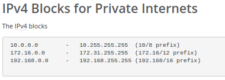
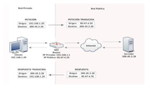
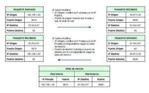
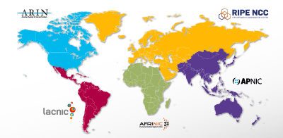
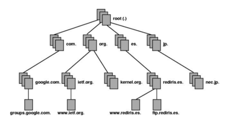

# Descubriendo la componente espacial de internet
Conferencia ESRI España 2019
Track Desarrolladores

## Introducción:

Todos los días nos conectamos a internet, pero, ¿sabemos realmente cómo funciona?, ¿qué pasa desde que escribimos en nuestro navegador hasta que se muestra la página solicitada?, ¿Internet ha cambiado desde sus orígenes?, etc.

Si intentamos explicárselo a nuestras abuelas, le diríamos algo así como que, **internet** es la *"red de redes"*, que todos los ordenadores están conectados entre sí y que unos piden información y otros se la devuelven. Pero, ¿realmente sabemos algo más?

La intención de esta demo es explicar alguno conceptos clave que nos ayudarán a comprender cómo se maneja algo con lo que convivimos a diario.

## ¿Cómo funciona internet?

Cuando accedemos a internet, lo hacemos a través de un **Proveedor de Serivcios de Internet**, es decir un **ISP**, que nos asignan una **dirección IP** de manera única e inequívoca a nivel mundial, que nos permite la comunicación con cualquier servidor. 

Sin embargo, el **ISP** no puede asignar cualquier código o dirección IP, ya que, existen una serie protocolos internacionales para la gestión de las mismas.

En la realización de estos protocolos se decidió que, todo el rango de direcciones IP disponibles se dividiría en dos grande grupos: **Ips Públicas** e **Ips Privadas**.

Las **Ips Públicas** son las que establece el **ISP** y se asigna a cualquier equipo o dispositivo conectado de forma directa a Internet. Por ejemplo, los servidores que alojan sitios web, los routers o modems que dan el acceso a Internet. Estas direcciones son visibles y tienen un coste que depende del ISP.

Las **Ips Privadas** se utilizan para identificar equipos o dispositivos conectados a una red doméstica o privada. Se reservan para ello determinados rangos de direcciones, que van en función del nuḿero de dispositivos conectados.

Este produce un ahorro considerable de direcciones. Sería imposible que todos dispositivo conectados a internet tuvieses una dirección Ip pública con las cantidad de direcciones disponibles.

 Fuente: Ripe NCC

### ¿Cómo se "traduce" o se "enruta" desde una Ip Privada a una Ip Pública?

Se realiza a través del NAT o Network Address Translation. Y que funciona de diferentes maneras:

- NAT estático: Una dirección IP privada se traduce siempre en una misma dirección IP pública. La principal desventaja de este esquema es que por cada equipo que se desee tenga acceso a Internet se debe contratar una IP pública. Este modo de funcionamiento permitiría a un dispositivo dentro de la red ser visible desde Internet.

- NAT dinámico: El router tiene asignadas varias direcciones IP públicas, de modo que cada dirección IP privada se mapea usando una de las direcciones IP públicas que el router tiene asignadas, de modo que a cada dirección IP privada le corresponde al menos una dirección IP pública. Cada vez que un dispositivo requiera una conexión a Internet, el router le asignará una dirección IP pública que no esté siendo utilizada. Ésto aumenta la seguridad ya que dificulta que otro dispositivo externo ingrese a la red ya que las direcciones IP públicas van cambiando.

- NAT con sobrecarga: El caso de NAT con sobrecarga o PAT (Port Address Translation) es el más común de todos y el más usado en los hogares. Consiste en utilizar una única dirección IP pública para mapear múltiples direcciones IPs privadas. Ventajas: por un lado, el cliente necesita contratar una sola dirección IP pública, lo que supone un importante ahorro económico; por otro lado se ahorra un número importante de IPs públicas, lo que demora el agotamiento de las mismas. Para poder hacer esto, el router hace uso de los 65.536 puertos de los que los protocolos TCP disponen para establecer conexiones. De modo que, cuando una máquina quiere establecer una conexión, el router guarda su IP privada y el puerto de origen y los asocia a la IP pública y un puerto al azar. Cuando llega información a este puerto elegido al azar, el router comprueba la tabla y lo reenvía a la IP privada y puerto que correspondan.

Fuente: www.xatakamovil.com 

Fuente: https://www.xatakamovil.com/

### Ipv4 vs Ipv6

Cómo hemos explicado cada dispositivo que se conecta a internet tiene una dirección Ip y cuando se diseño internet se pensó en un protocolo que sirviera para asignar esas direcciones de forma organizada.
Así surgió IPv4, un protocolo con direcciones de 32 bits que permitía generar direcciones IP para 2^32 dispositivos. O lo que es lo mismo, 4.300 millones de ellos.

[Direccionamiento Ipv4](https://www.youtube.com/watch?v=nVKZs-_-7U4)

A medida que pasa el tiempo aparecen más y más dispositivos conectados que requieren de una dirección Ip y, por lo tanto, este rango de direcciones inicial parece insuficiente.

Para solventar ésto se diseño el protocolo Ipv6. Este protocolo  proporciona un rango de 128 bits: 2^128 direcciones a disposición de 340 sextillones de dispositivos.

En un principio, uno podría imaginarse que el problema estaría solventado, pero que tener en cuenta que cuando se diseñó la versión 6 del protocolo IP no se hizo compatible con la anterior. Esto se traduce en que si un usuario se conecta a internet a través del protocolo Ipv6 no podrá comunicarse con la mayor parte de la red, que funciona con Ipv4. La única forma de mantenerse conectado es que usen ambas versiones, simultáneamente (**dual stack**).

### ¿Quién es el responsable de asignar las direcciones Ips?

La **IANA** es responsable de administrar la zona raíz del Sistema de Nombres de Dominio (DNS), coordinar la asignación mundial de las direcciones del Protocolo de Internet (IP), y gestionar los sistemas de numeración IP. Básicamente, se encargan de mantener y administrar las funciones técnicas que posibilitan que Internet opere sin problemas.

IANA no puede satisfacer la demanda de asignación de direcciones IPs debido al gran volumen de dispositivos que crece día a día, por lo que la totalidad de la gestión se administran mediante organizacionesa nivel regional, estableciendo los Registros Regionales de Internet (RIR), estas cinco entidades son: AFRINIC, APNIC, ARIN, LACNIC, RIPE NCC

   Fuente: Ripe NCC

Los **Registros Regionales de Internet** (RIRs) administran, distribuyen y registran todos los recursos de números de Internet (direcciones IPv4 e IPv6 y Números de Sistemas Autónomos) dentro de sus respectivas regiones.
Son asociaciones sin ánimos de lucro y son miembros en su respectiva región de acuerdo con las leyes del país en el que se encuentra. Son gobernados por Juntas elegidas por sus miembros y son financiadas por los honorarios pagados por las organizaciones participantes. 

**RIPE NCC** es la organización responsable de asignar estos recursos en nuestra área geográfica.

A su vez, la asociación **RIPE NNCC** está conformado por lo que se denominan Local Internet Registry (LIR). Cada **LIR** o miembro de la **RIPI NCC** es responsable de la distribución del espacio y el registro de un rango de direcciones a nivel local, además de asegurar que las políticas y procedimientos se sigan a nivel local. 
Las organizaciones que se convierten en LIR son principalmente proveedores de servicios de Internet (ISP) que asignan estas direcciones a sus clientes, organizaciones de telecomunicaciones y empresariales, así como a instituciones académicas. 

[IANA](images/IANA.png)
   Fuente: Ripe NCC

### Sistemas autónomos

Un sistema autónomo (AS) es un conjunto de redes IP ejecutadas por uno o más operadores de red con una política de enrutamiento única y claramente definida.

Cada SA tiene un número asociado el cual es usado como un identificador en el intercambio de información. Para el intercambia de información entre estos SA se utilizan protocolos tales como BGP.

Los Números de Sistema Autónomo (SAN) serán distribuidos por cada RIRs entre las organizaciones que lo conformen y que cumplan una serie de requisitos.

Consulta [registro de Números de Sistemas Autónomos](https://www.iana.org/assignments/as-numbers/as-numbers.xhtml)

### DNS

**DNS** son las iniciales de Domain Name System (sistema de nombres de dominio) y es una tecnología basada en una base de datos que sirve para resolver nombres en las redes, es decir, para conocer la dirección IP de la máquina donde está alojado el dominio al que queremos acceder.

Está compuesto por tres partes con diferentes funciones:

- Cliente DNS: está instalado en el cliente (es decir, nosotros) y realiza peticiones de resolución de nombres a los servidores DNS.
- Zonas de autoridad: son servidores o grupos de ellos que tienen asignados resolver un conjunto de dominios determinado (como los .es o los .org).
- Servidor DNS: son los que contestan las peticiones y resuelven los nombres mediante un sistema estructurado en árbol. Las direcciones DNS que ponemos en la configuración de la conexión, son las direcciones de los Servidores DNS.

Fuente: https://www.xatakamovil.com/

La resolución de nombres utiliza una estructura en árbol, mediante la cual los diferentes servidores DNS de las zonas de autoridad se encargan de resolver las direcciones de su zona, y sino se lo solicitan a otro servidor que creen que conoce la dirección. 

Proceso de una petición DNS sencilla: 
1. El Sistema Operativo comprueba que se haya ejecutado esta petición y entonces realiza la petición al servidor DNS configurado manualmente o mediante DHCP y es el que se denomina servidor raíz (ROOT-SERVER)
2. El servidor DNS que tenemos configurado tampoco tiene memorizada la dirección IP de ese dominio, por lo que realiza una petición al servidor encargado de la zona de autoridad (ejemplo .com). Servidor de nombres de dominio de primer nivel (TLD).
3. El servidor encargado de la zona de autoridad (.com) tiene una tabla de datos en los que están almacenados las direcciones IP de las máquinas y sus dominios. Lo busca y le responde al servidor DNS que está configurado en nuestra máquina con una dirección IP.
4. Por último, ahora que conocemos la direccíon IP de nuestra consulta es el propio navegador el que realiza la consulta con la Ip resulta.

## Sabías que ...

### Ip brokers

De momento, muy poco dispositivos se conecta a través del protocolo más Ipv6, por lo que no podremos abandonar el IPv4 hasta dentro de "algún tiempo". La estrategía de migracion que se utiliza actualmente conlleva que convivan los dos protocolos, por lo que ambos deben seguir creciendo.

Desde hace años han surgido diversos "IP brokers", revendedores de paquetes de direcciones IPv4 que por uno u otro motivo ya no se utilizan y que estos intermediarios le venden a empresas y organismos que las necesitan para sus usuarios.

### Conexiones VPN para evitar la censura
Conexión que permite una extensión de tu red local o **LAN**, que tradicionalmente se usaban más en el entorno empresarial, pero que ahora están adquiriendo mucha relevancia por las distintas utilidades que proporciona. Como por ejemplo, acceder a la versión de EEUU de Netflix o evitar la censura de un país.

¿Cómo funciona?
Gracias a la tecnología VPN nuestro equipo se conecta a internet a través del ISP, y de ahí al servidor VPN. Esto nos permite obtener una dirección IP diferente a la nuestra. Así, si nos queremos conectar a un servicio que bloquee la Ips de nuestro país, podremos hacerlo, ya que, a efectos pŕacticos, para el servidor la Ip será la Ip del servidos VPN y si este VPN está en el mismo país, entonces no habrá bloqueo.

### spoofing

El "Spoofing" se refiere al uso de técnicas o suplantación de identidad.
Dependiendo de la tecnología que se utilice, existen distintos tipos de spoofing. Entre ellos están el IP spoofing, que consiste básicamente en sustituir la dirección IP origen de un paquete TCP/IP por otra dirección IP a la cual se desea suplantar. 

Por lo tanto, se redirige al cliente, es decir, a nosotros, a otra página o web falsa, normalmente para obterner información como pueden ser nombres de usuarios o contraseñas

[Más info](https://www.iplocation.net/ip-spoofing)

Amazon a sufrido uno de estos ataques recientemente.
Uno de los casos más famosos de Spoofing de los últimos meses es el de Pokémon GO, que permitía a los entrenadores cambiar su ubicación a través del GPS para así recoger Pokémon sin moverse de casa. 

### Caso de Google Street Maps

Los coches de Google, además de fotografíar las calles de muchas ciudades para ofrecer mapas ilustrados, se dedicaban a grabar cualquier dato sensible de redes sin contraseña, sin el consentimiento expreso de sus propietarios, haciéndose con datos tales como usuarios y contraseñas de entrada a correos electrónicos y otros servicios o direcciones IP.

## Ejemplo visualización de datos 

## Recursos
#### Demo visualización de datos
- https://github.com/umaar/wiki-globe
- BBDD https://iptoasn.com/
- https://developers.arcgis.com/

#### Información
- RIPE NCC: https://ripe.net
- LECTURAS: 
    - https://www.xataka.com/
    - https://www.iplocation.net/
    - https://www.theguardian.com/technology/2010/may/15/google-admits-storing-private-data